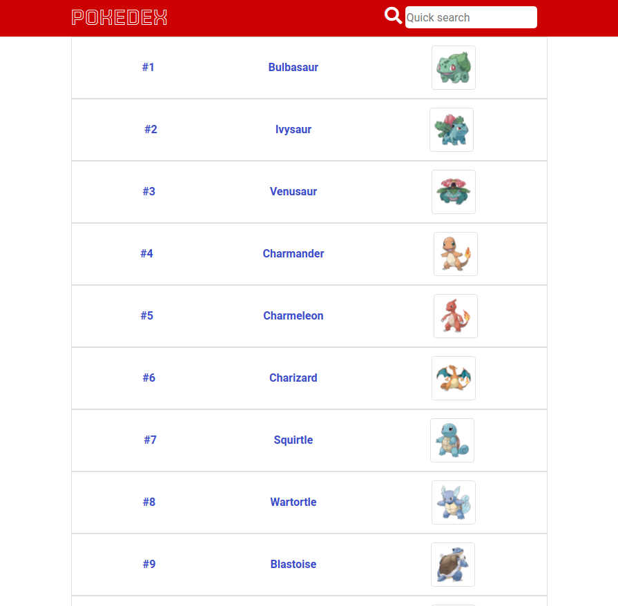
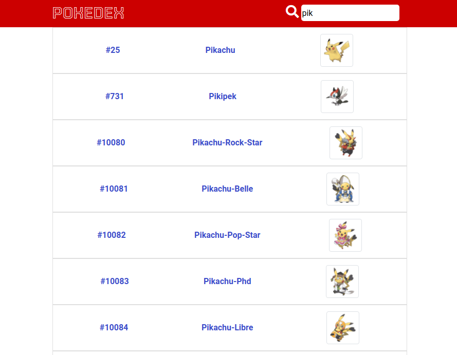
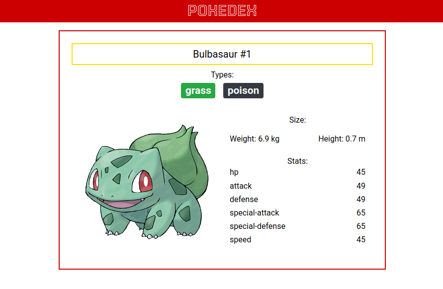
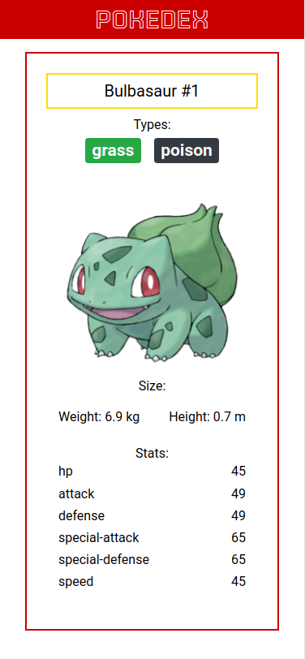

# POKEDEX

- Pokedex -list of all pokemons and most important info about them.
- Live demo [_here_](https://mj-pokedex.netlify.app/)

## Table of Contents

- [General Info](#general-information)
- [Technologies Used](#technologies-used)
- [Features](#features)
- [Screenshots](#screenshots)
- [Project Status](#project-status)

## General Information

- Data about pokemons from API -> https://pokeapi.co/ .
- Searching by name of pokemon.
- Pokedex contains the most important info about pokemons: size, type, stats, id and photo.

## Technologies Used

- React
- React router
- SASS
- React Bootsrtap

## Features

List the ready features here:

- import list of pokemons and more information from API
- dynamic search by name

## Screenshots

## Project Status

Project is: _in progress_
